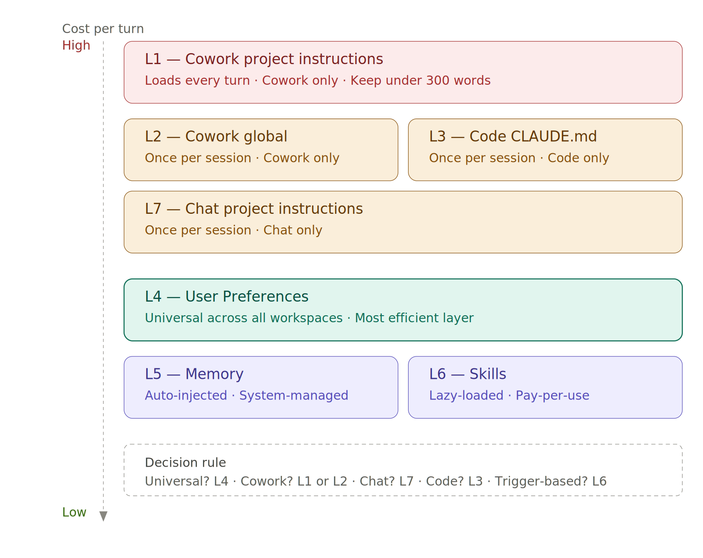
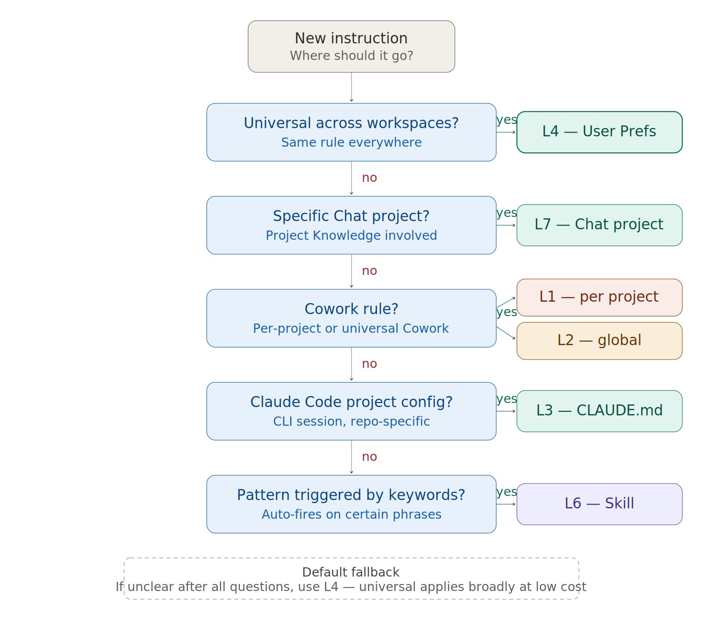

# LLM Cost Kit

> 40-70% cost reduction for Claude, ChatGPT, and Gemini — without quality loss.

A complete, layered architecture for managing instructions across all surfaces of an LLM workflow.

## Download

Pick the kit for your platform from [Releases](https://github.com/YOUR_GITHUB_USERNAME/llm-cost-kit/releases/latest):

| Kit | For |
|---|---|
| `claude-cost-kit.zip` | Claude.ai, Claude Code, Cowork users |
| `openai-cost-kit.zip` | ChatGPT, Custom GPTs, OpenAI API |
| `gemini-cost-kit.zip` | Gemini, Gem builder, AI Studio |
| `llm-cost-kit.zip` | All three platforms in one bundle |

## The 7-layer hierarchy

The most important concept in this kit. Where you put your instructions matters as much as what they say.



## Decision tree — where should this rule go?

For any new instruction, walk this tree to find the right layer.



## Quick start

```bash
git clone https://github.com/YOUR_GITHUB_USERNAME/llm-cost-kit
cd llm-cost-kit/platforms/claude

# Install scripts
chmod +x scripts/update-claude-cost scripts/emit-l7-helper.py
cp scripts/update-claude-cost scripts/emit-l7-helper.py ~/.local/bin/

# Initialize your cost file
update-claude-cost --plan YOUR_PLAN --fee YOUR_MONTHLY_FEE --renews YYYY-MM-DD

# Set your skills-source directory
export SKILLS_SOURCE_DIR=~/dev/your-skills-repo   # add to ~/.zshrc

# Deploy instruction files
cp GLOBAL-CLAUDE.md ~/.claude/CLAUDE.md            # Code global (L3)
cp CLAUDE.md your-project/CLAUDE.md               # Code project (L3)
# Paste cowork-global-instructions.md into Cowork global settings (L2)
```

Then wire the hourly pipeline. See [`platforms/claude/scripts/cumulative-cost-launchagent.sh`](platforms/claude/scripts/cumulative-cost-launchagent.sh).

## What's new in v3.5.2

- **Cache hygiene rule 4** — CI/E2E fix retry loop identified as highest-cost anti-pattern. One debugging day, 8 micro-sessions = $17.83 at 100% wasted writes. Fix: stay in ONE session per debug cycle.
- **L2 + L3-global auto-refresh** — `--emit-l2` and `--emit-l3-global` flags extend the hourly pipeline to Cowork global instructions and Code CLAUDE.md. Cost tally now stays current across all three machine-reachable instruction surfaces.
- **Token limit suppression fix** — Code CLAUDE.md now includes explicit `not subject to token limits` directive for the cost tally. Without it, the model omits the tally on short responses.
- **Two-pool model corrected** — `subscription` (flat fee) + `api_pool` (all pay-as-you-go). `extra_usage_enabled` is a boolean, not a third pool.
- **Plan display fix** — `max-5x` renders as `Max 5x` (not `Max-5X`) in auto-refreshed sections.

Previous versions: [v3.4](https://github.com/YOUR_GITHUB_USERNAME/llm-cost-kit/releases/tag/v3.4) · [v1.0](https://github.com/YOUR_GITHUB_USERNAME/llm-cost-kit/releases/tag/v1.0)

## What you'll save

Real-world numbers from heavy-usage measurement on Claude Max plan:

| Metric | Before | After | Win |
|---|---|---|---|
| Cowork skills loaded per turn | ~7,500 tokens | ~800 tokens | −89% |
| L1 project instructions per-turn | ~4,000 tokens | ~130 tokens | −97% |
| Per-turn cost (Sonnet 4.6 / Medium) | ~$0.04 | ~$0.005 | −88% |
| Cache amortization ratio | 0.16 | 0.6+ | +275% |
| Monthly waste (cache writes) | ~$40 | < $10 | −75% |

## The cache amortization problem

Claude's 5-minute cache TTL charges 1.25× for writes and 0.1× for reads. Break-even: ~3 reads per write (ratio ≥ 0.5). Real-world measurement found a ratio of **0.16** — meaning 40% of spend was going to cache writes that expired unused.

Four anti-patterns drive this. Full analysis: [`core/CACHE_HYGIENE.md`](core/CACHE_HYGIENE.md)

Full framework with impact analysis: [`docs/responsible-ai-cost-framework.md`](docs/responsible-ai-cost-framework.md)

## Scripts

| Script | Purpose |
|---|---|
| `update-claude-cost` | Main CLI: track cost state, update instruction layers, log throttles |
| `emit-l7-helper.py` | Emits live cost tally to L7 (Chat), L2 (Cowork), L3-global (Code) |
| `cache-efficiency` | Compute amortization ratio from ccusage data |
| `admin-api-pull.py` | Pull API pool state via Anthropic Admin API |

## Enhancement requests for Anthropic

Six gaps documented at [`docs/anthropic-enhancement-requests.md`](docs/anthropic-enhancement-requests.md):

1. Billing UI two-pool breakdown
2. Admin API `resets_on` field
3. Standardized limit labels
4. Cache amortization visibility
5. Usage event webhooks
6. Cowork instruction API access

## The responsible AI angle

Wasted cache writes aren't just a cost problem — they're a compute waste problem. At scale, low amortization ratios mean significant GPU time consumed for no user-visible outcome. As compute supply tightens relative to demand, workflow efficiency becomes an ethical concern, not just a personal finance one.

Full analysis: [`docs/responsible-ai-cost-framework.md`](docs/responsible-ai-cost-framework.md)

## License

Apache 2.0 — free to use, modify, share.

## Issues + contributions

Open issues at https://github.com/YOUR_GITHUB_USERNAME/llm-cost-kit/issues. PRs welcome.
