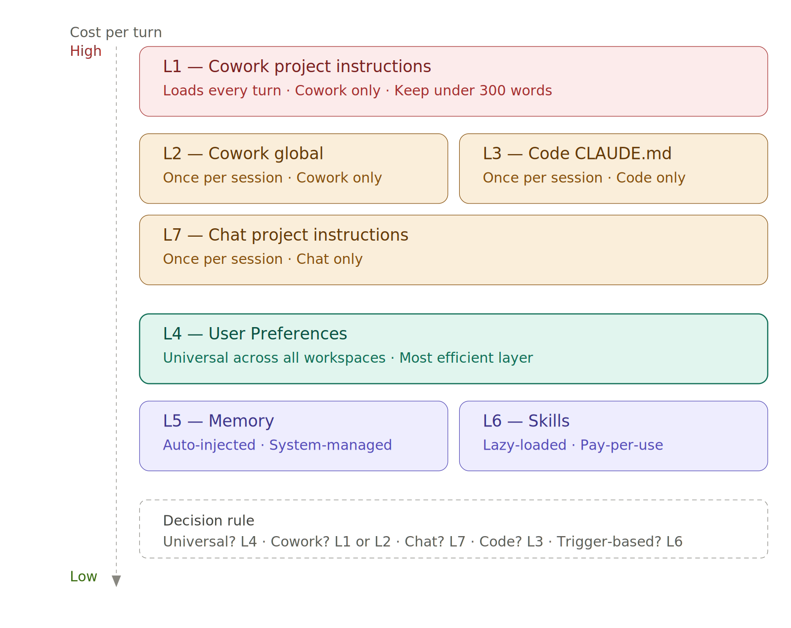
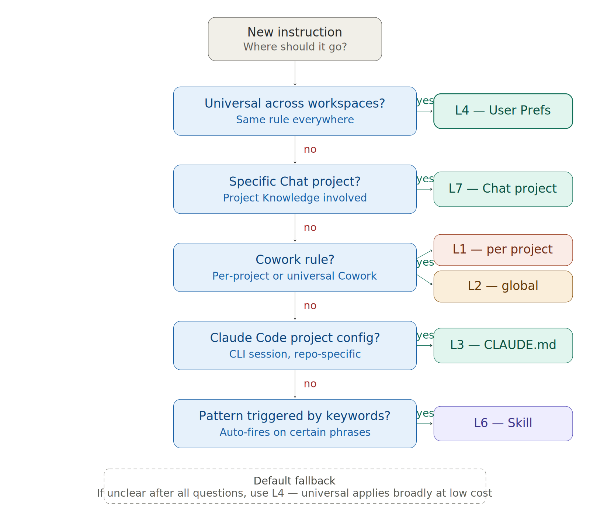

# LLM Cost Kit

> 40-70% cost reduction for Claude, ChatGPT, and Gemini — without quality loss.

A complete, layered architecture for managing instructions across all surfaces of an LLM workflow.

> **Before you use this kit, replace the placeholders with your own details.** A few files
> ship with `[YOUR_NAME]`, `[YOUR_EMAIL]`, `[YOUR_GITHUB]`, `[YOUR_TITLE]`, and `[YOUR_PRODUCT]`
> placeholders (mainly in the sample Anthropic letter), and LaunchAgent labels use
> `com.${USER}.*` or `com.YOURUSER.*`. Swap in your own values so nothing references the author.

## Download

Pick the kit for your platform from [Releases](https://github.com/daskuntal75/llm-cost-kit/releases/latest):

| Kit | For |
|---|---|
| `claude-cost-kit.zip` | Claude.ai, Claude Code, Cowork users |
| `openai-cost-kit.zip` | ChatGPT, Custom GPTs, OpenAI API |
| `gemini-cost-kit.zip` | Gemini, Gem builder, AI Studio |
| `llm-cost-kit.zip` | All three platforms in one bundle |

## The 7-layer hierarchy

The most important concept in this kit. Where you put your instructions matters as much as what they say.



## Decision tree — where should this rule go?

For any new instruction, walk this tree to find the right layer.



## Quick start

### Before you start — have these ready

| Need | Where to get it | Why |
|---|---|---|
| Apple ID password | — | Mac initial setup, App Store, iCloud |
| GitHub credentials | github.com | `bootstrap-macos.sh` runs `gh auth login` (opens browser) |
| Anthropic account | claude.ai | First `claude` CLI run does OAuth |
| Anthropic Admin API key *(optional)* | console.anthropic.com → Settings → Admin Keys | Enables `update-claude-cost --pull-api-spend` |
| Skills-source repo URL *(optional)* | your private GitHub | The setup will offer to bootstrap `~/dev/skills-source/` |
| Your plan details | claude.ai/settings/billing | Need plan name, monthly fee, renewal date for step 5 |

### Fresh Mac (Mac Mini, new laptop) — 3 scripts, ~30 min

```bash
git clone https://github.com/daskuntal75/llm-cost-kit ~/dev/llm-cost-kit
cd ~/dev/llm-cost-kit

# 1. Pre-flight: brew, node, jq, fswatch, gh, Claude Desktop, gh auth login
bash bootstrap-macos.sh

# 2. One-time Anthropic OAuth (browser opens)
claude

# 3. Main setup: Claude Code CLI, ccusage, MCP configs, aliases, skills, cost LaunchAgent
bash setup.sh
source ~/.zshrc

# 4. Initialize your cost state
update-claude-cost --plan YOUR_PLAN --fee YOUR_MONTHLY_FEE --renews YYYY-MM-DD

# 5. Verify: green/red dashboard
bash verify.sh
```

### Already have a working Mac

Skip step 1. Just `bash setup.sh` then `bash verify.sh`.

### After the scripts — manual web-UI steps (~20 min, cannot be scripted)

| Layer | Paste from (in repo) | Paste to |
|---|---|---|
| **L4** universal | `core/OUTPUT_RULES.md` | claude.ai → Settings → Profile → Preferences |
| **L2** Cowork global | `platforms/claude/cowork-global-instructions.md` | claude.ai → Cowork → Settings → Global Instructions |
| **L1** per Cowork project | `platforms/claude/cowork-project-instructions.md` (tailored) | each Cowork project's instructions |
| **L7** per Chat project | `platforms/claude/chat-project-instructions.md` (tailored) | each Chat project's instructions |
| **L6** skills | `~/dev/skills-source/.build/*.skill` | claude.ai → Cowork → Customize → Skills → Install from file |
| **MCP Connectors** | n/a | https://claude.ai/settings/connectors — re-auth Gmail, Drive, Calendar, Granola, Gamma, Stripe, Supabase |

Then re-run `bash verify.sh` — the L3-global check confirms instruction files landed.

### Heads-up

1. **Don't reuse an old `~/.claude` from a Time Machine restore.** Let `bootstrap-macos.sh` + first `claude` run create fresh state. Old MCP tokens will fail silently and waste a debugging hour.
2. **Run `verify.sh` twice — once after the scripts, once after the manual paste work.** The first run confirms the automated half; the second catches anything you missed in the UI.

Hourly pipeline auto-refreshes L2 + L3-global + L7 cost tally. See [`platforms/claude/scripts/cumulative-cost-launchagent.sh`](platforms/claude/scripts/cumulative-cost-launchagent.sh).

## What's new in v3.9.4

- **Setup scripts are zsh-safe even when invoked as `bash`.** `setup.sh`, `verify.sh`, and `bootstrap-macos.sh` now re-exec under zsh if started with `bash` (e.g. `bash setup.sh`). They use the zsh-only `read -k` builtin, which crashes bash around line 179 and silently skips the cumulative-cost install. All usage comments, cross-references, and `guide.html` run instructions now say `zsh <script>`.
- **Homebrew ownership check for restricted (non-admin) users.** `bootstrap-macos.sh` detects a non-writable `/opt/homebrew` and tells an admin to run `sudo chown -R <user> /opt/homebrew` once. Never `sudo brew`.
- **claude-code cask vs npm collision handled.** When `claude-code` is installed as a Homebrew cask, `npm i -g @anthropic-ai/claude-code` errors `EEXIST` on `/opt/homebrew/bin/claude`. Both installers now detect a brew-managed `claude`, skip the npm install, and point to `brew upgrade --cask claude-code`.

## What's new in v3.9.3

- **Human-voice writing standard** — new always-active, top-priority rule in `platforms/claude/GLOBAL-CLAUDE.md` and `core/OUTPUT_RULES.md`. All generated prose (emails, posts, docs, profiles, resumes, marketing copy, chat replies) must read like a specific human wrote it, with zero AI tell-tale signatures. The load-bearing rule: **no em-dashes (the "—" character), ever**, the single most-flagged AI signature. Plus a banned-vocabulary list (delve, robust, seamless, leverage, foster, tapestry, testament, and more), banned patterns ("it's not just X, it's Y," reflexive rule-of-three, participle filler tails, empty closers), and a "do instead" checklist (vary sentence length, concrete numbers, plain copulas, read-aloud test). Code, identifiers, log keys, direct quotations, and format-locked strings are exempt.

## What's new in v3.9.2

- **Squash-merge-aware drift checker** — the branch-cadence "Drift thresholds" rule in `platforms/claude/GLOBAL-CLAUDE.md` now leads with a tree-equality query (`git diff --quiet origin/main..origin/develop`) instead of the SHA-count one-liner. After a squash-merge from a release branch into `main`, the SHA count keeps reporting the original commits as "ahead" forever — even when trees are byte-identical — producing a permanent phantom 🔴 RED. Tree-equality is the canonical "no drift" gate; SHA count is the fallback when trees actually differ.
- **`scripts/check_drift.sh` recipe** — guidance for projects to ship a per-repo drift checker with exit codes `0` / `1` / `2` mapped to green / amber / red, so cron + CI can gate on it.
- **Merge-commit over squash for release-train PRs** — new one-liner under the table recommends `--no-ff` merges from `develop` → `main` to avoid producing phantom drift in the first place. Squash stays fine for small feature PRs into `develop`.

## What's new in v3.9.1

- **Orchestrator status/report split (statusline TUI fix)** — the autonomous-`/loop` and scheduled-standup end-of-run report now writes **two** files, both overwritten (never appended): the full report → `~/.claude/orchestrator-phase.txt` (latest run only), and a **single line** → `~/.claude/orchestrator-status.txt`. The statusline reads ONLY the 1-line status file (hard-capped to its first line), so a growing report can never flood/illegibly fill the Claude Code prompt area. Fixes the failure mode where an append-only log + `cat`-the-whole-file statusline made the TUI unusable.

## What's new in v3.9

- **Pre-compact handoff protocol** — Stop hook `handoff-watcher.sh` computes session pressure (turn count, cumulative tool-calls, idle time since last user message) after every turn and writes `~/.claude/handoff-state.json` (now including the project-scoped `handoff_file` path). Statusline shows live indicator `compact 🟢/🟡/🔴 (Nt/Mc, idle Xm)`. When 🟡 or 🔴 fires, the hook emits a stderr nudge — Claude Code surfaces it as a system-reminder on the next turn, telling the model to write/refresh the **project + session-scoped** handoff at `~/.claude/projects/<encoded-cwd>/last-handoff-<session-short>.md` with a pickup brief BEFORE doing anything else. Project-scoped since 2026-05-22, session-scoped since 2026-05-30 (two real incidents: parallel sessions in different cwds, then two sessions in the *same* cwd, overwriting each other's briefs). The path is computed from `$CLAUDE_CODE_SESSION_ID`, never the shared `handoff-state.json`.
- **`/handoff` skill** — slash-command form of the same protocol for user-initiated checkpoints (paste `/handoff` any time to force a brief).
- **Auto-recommendation between `/clear` and `/compact`** — idle > 5 min → `/clear` (cache cold; `/compact` wastes money), idle ≤ 5 min → `/compact` (cache warm, ~10% summary cost). Tunable via `HANDOFF_TURNS_YELLOW`/`_RED`, `HANDOFF_TOOLS_YELLOW`/`_RED`, `HANDOFF_IDLE_YELLOW_MIN` env vars.
- **Self-contained pickup prompt embedded in the brief** — the brief includes a copy-pasteable first message for the post-clear/compact session so the new agent picks up with zero context loss.

## What's new in v3.8.1

- **Compact 2-line cost tally** — replaces the verbose 3-line block with a 2-line format. Adds a per-turn `Tools: A/35` counter so the tally shows tool-use pressure inline; drops fields already surfaced by `update-claude-cost` (full ccusage value, tier name, reset timestamps, Extra-usage flag, Throttle line). Existing installs migrate cleanly on the next hourly LaunchAgent refresh — `emit-l7-helper.py` regex matches both old and new formats.
- **Null-safe burn calculation** — `update-claude-cost.sh` now uses `// 0` defaults on `.api_pool.recent_monthly_burn`, so fresh installs without a seeded API balance no longer crash the recompute step or print empty fields in the report summary.
- **Verdict shortener** — long verdict strings (`DOWNGRADE CANDIDATE`, `STRONG DOWNGRADE`, `BELOW BREAK-EVEN`, `PLAN CORRECTLY SIZED`) compressed to fit the 2-line budget without truncation: `DOWNGRADE`, `STRONG-DN`, `BELOW-BE`, `SIZED`.

## What's new in v3.8

- **Pattern-aware warnings** — counter hook now emits 💡 nudges as anti-patterns happen: 3+ sequential `Bash` calls (chain candidate), 5+ sequential same-tool calls (batch candidate), turn ≥ 15 calls (delegate candidate). Each fires once per turn; no spam.
- **`tool-use-stats --lint`** — retrospective scan of `history.jsonl` for rule-1/2/3 violations across the last 7 days, with estimated slot-waste figure. Run weekly to spot drift before it costs forced-continue turns.
- **Opt-in hard enforcement** — `TOOL_USE_HARD_BLOCK=1` makes the PreToolUse hook return `permissionDecision: deny` at 85% of soft target. Claude Code blocks the tool call and feeds the reason back to the model, forcing a checkpoint or delegation.
- **Automation-tier matrix** — `core/TOOL_USE_HYGIENE.md` now documents what's auto-preventable (rule 3 only, opt-in), auto-detectable (all three rules), and auto-fixable (none — they're prompt-level decisions). Sets honest expectations.

## What's new in v3.7

- **Tool-use hygiene** — new fifth operational discipline alongside cache, instruction-layer, autonomy, and cost. PreToolUse hook (`~/.claude/hooks/tool-use-counter.sh`) counts every tool call per turn, emits stderr warnings at 70% and 85% of the soft target (default 35; hard cap ~50 enforced by Claude Code itself). Stop hook flushes per-turn buckets to `~/.local/cost/tool-counts/history.jsonl`. Hooks register automatically via `setup.sh`; `verify.sh` confirms wiring.
- **`tool-use-stats` CLI** — rolling-window summary of turn counts (`tool-use-stats`, `--by-tool`, `--max`, `--tail`). Surfaces p50/p90/max and percentage of turns ≥70%/≥85% so you can see drift before you hit the cap.
- **`core/TOOL_USE_HYGIENE.md`** — sibling rule-set to `CACHE_HYGIENE.md`. Three measured anti-patterns (sequential reads when parallel possible, individual Bash when chainable, refusing to delegate to subagents) plus three rules. The forced "continue" turn after hitting the cap typically costs a full cache miss; preventing it is genuinely cost-saving, not just UX.
- **`GLOBAL-CLAUDE.md` rule** — auto-loaded directive that tells the model how to react to threshold warnings: stop, batch, chain, or delegate.

## What's new in v3.6

- **`bootstrap-macos.sh`** — pre-flight installer for a bare Mac. Handles Xcode CLT, Homebrew, node/npm, jq, fswatch, git, gh, and the Claude Desktop cask before `setup.sh` runs. Closes the prereq gap `setup.sh` previously assumed.
- **`verify.sh`** — green/red dashboard for prereqs, auth state, cost-tracking init, LaunchAgent status, MCP configs, and instruction-layer presence. Run anytime to confirm a setup is healthy.
- **MCP connector reminder** — `setup.sh` tail and `verify.sh` now surface [claude.ai/settings/connectors](https://claude.ai/settings/connectors), the one step every fresh-machine setup forgets.

## What's new in v3.5.2

- **Cache hygiene rule 4** — CI/E2E fix retry loop identified as highest-cost anti-pattern. One debugging day, 8 micro-sessions = $17.83 at 100% wasted writes. Fix: stay in ONE session per debug cycle.
- **L2 + L3-global auto-refresh** — `--emit-l2` and `--emit-l3-global` flags extend the hourly pipeline to Cowork global instructions and Code CLAUDE.md. Cost tally now stays current across all three machine-reachable instruction surfaces.
- **Token limit suppression fix** — Code CLAUDE.md now includes explicit `not subject to token limits` directive for the cost tally. Without it, the model omits the tally on short responses.
- **Two-pool model corrected** — `subscription` (flat fee) + `api_pool` (all pay-as-you-go). `extra_usage_enabled` is a boolean, not a third pool.
- **Plan display fix** — `max-5x` renders as `Max 5x` (not `Max-5X`) in auto-refreshed sections.

Previous versions: [v3.4](https://github.com/daskuntal75/llm-cost-kit/releases/tag/v3.4) · [v1.0](https://github.com/daskuntal75/llm-cost-kit/releases/tag/v1.0)

## What you'll save

Real-world numbers from heavy-usage measurement on Claude Max plan:

| Metric | Before | After | Win |
|---|---|---|---|
| Cowork skills loaded per turn | ~7,500 tokens | ~800 tokens | −89% |
| L1 project instructions per-turn | ~4,000 tokens | ~130 tokens | −97% |
| Per-turn cost (Sonnet 4.6 / Medium) | ~$0.04 | ~$0.005 | −88% |
| Cache amortization ratio | 0.16 | 0.6+ | +275% |
| Monthly waste (cache writes) | ~$40 | < $10 | −75% |

## The cache amortization problem

Claude's 5-minute cache TTL charges 1.25× for writes and 0.1× for reads. Break-even: ~3 reads per write (ratio ≥ 0.5). Real-world measurement found a ratio of **0.16** — meaning 40% of spend was going to cache writes that expired unused.

Four anti-patterns drive this. Full analysis: [`core/CACHE_HYGIENE.md`](core/CACHE_HYGIENE.md)

Full framework with impact analysis: [`docs/responsible-ai-cost-framework.md`](docs/responsible-ai-cost-framework.md)

## Scripts

| Script | Purpose |
|---|---|
| `update-claude-cost` | Main CLI: track cost state, update instruction layers, log throttles |
| `emit-l7-helper.py` | Emits live cost tally to L7 (Chat), L2 (Cowork), L3-global (Code) |
| `cache-efficiency` | Compute amortization ratio from ccusage data |
| `admin-api-pull.py` | Pull API pool state via Anthropic Admin API |
| `tool-use-stats` | Rolling-window summary of tool-use-counter history (v3.7) |
| `hooks/tool-use-counter.sh` | PreToolUse hook — counts calls + threshold warnings (v3.7) |
| `hooks/tool-use-reset.sh` | Stop hook — flushes per-turn bucket to history (v3.7) |

## Platform comparison — Claude vs OpenAI vs Gemini

Which platform does the most to help you control what you spend?

| Dimension | Winner |
|---|---|
| Cache savings ceiling | **Claude** (90% read discount) |
| Cache transparency | **Gemini** (explicit API, configurable TTL) |
| Zero-friction caching | **OpenAI** (automatic, no config) |
| Cost visibility / billing UI | **OpenAI / Gemini** |
| Model routing granularity | **Claude** (3 tiers + effort levels) |
| Long-context cost efficiency | **Gemini** (Flash + 1M tokens) |

Full comparison with caching mechanics, anti-patterns, and routing guides: [`docs/llm-comparison.md`](docs/llm-comparison.md)

Platform-specific cache hygiene:
- Claude: [`core/CACHE_HYGIENE.md`](core/CACHE_HYGIENE.md)
- OpenAI: [`platforms/openai/CACHE_HYGIENE.md`](platforms/openai/CACHE_HYGIENE.md)
- Gemini: [`platforms/gemini/CACHE_HYGIENE.md`](platforms/gemini/CACHE_HYGIENE.md)

## Enhancement requests for Anthropic

Six gaps documented at [`docs/anthropic-enhancement-requests.md`](docs/anthropic-enhancement-requests.md):

1. Billing UI two-pool breakdown
2. Admin API `resets_on` field
3. Standardized limit labels
4. Cache amortization visibility
5. Usage event webhooks
6. Cowork instruction API access

Filed as GitHub issues: [anthropics/anthropic-sdk-python/issues](https://github.com/anthropics/anthropic-sdk-python/issues)

## The responsible AI angle

Wasted cache writes aren't just a cost problem — they're a compute waste problem. At scale, low amortization ratios mean significant GPU time consumed for no user-visible outcome. As compute supply tightens relative to demand, workflow efficiency becomes an ethical concern, not just a personal finance one.

Full analysis: [`docs/responsible-ai-cost-framework.md`](docs/responsible-ai-cost-framework.md)

## License

CC BY-NC 4.0 — free to use, modify, and share for non-commercial purposes. Attribution required.
See [LICENSE](LICENSE) for full terms.

## Issues + contributions

Open issues at https://github.com/daskuntal75/llm-cost-kit/issues. PRs welcome.
