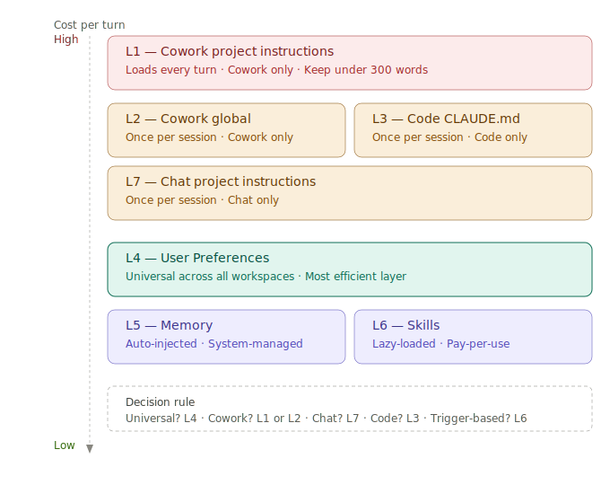
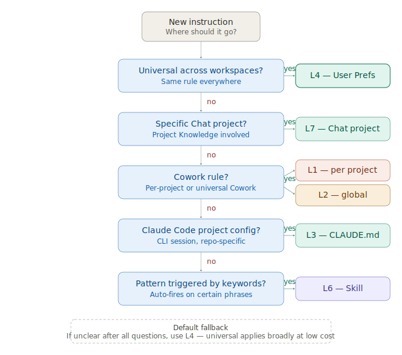

# Layered Instruction Hierarchy

The single biggest cost-optimization win for Claude (and adaptable to OpenAI/Gemini) is putting your instructions in the right *layer*. Instructions at the wrong layer either fail to fire OR reload every turn and burn tokens unnecessarily.

This guide maps the 7 layers, what loads them, when they fire, and which workspace they apply to.

---

## The 7 layers — visual



(SVG renders inline in any markdown viewer that supports SVG. PNG export available in `diagrams/` for use in slides/posts.)

---

## The 7 layers — table

| Layer | Name | Workspace | Loads | Token cost |
|---|---|---|---|---|
| **L1** | Cowork project instructions | Cowork only | **Every turn** | High (multiplies by turn count) |
| **L2** | Cowork global instructions | Cowork only | Once per session, cached | Medium (one-time per session) |
| **L3** | Claude Code CLAUDE.md | Code only | Once per session | Medium-high (cached) |
| **L4** | User Preferences (account-wide) | All workspaces | Once per session | Low (compact) |
| **L5** | Memory (auto-generated) | Chat + Cowork | Auto-injected | Variable |
| **L6** | Skills (lazy-loaded) | All Claude workspaces | Only when triggered | Pay-per-use |
| **L7** | Chat project instructions | Chat only | Once per session | Low-medium (cached) |

Below for each: what it is, what to put there, what NOT to put there.

---

## L1 — Cowork Project Instructions

**Loads:** Every turn (re-injected on every user message)
**Cost profile:** Linear with turn count — a 5,000-token L1 across 30 turns = 150,000 input tokens for the project context alone

**Use for:** Project-specific must-knows that change between projects (stack, security non-negotiables, project-specific routing overrides). Be ruthlessly lean.

**Do NOT put here:**
- Universal rules (those go in L2 or L4)
- Long context that's the same every turn (waste)
- Memory format directives (those go in L2)
- Skill behavior overrides (those go in L2)

**Target:** Under 300 words. Aim for 120–200.

---

## L2 — Cowork Global Instructions

**Loads:** Once per session, cached
**Cost profile:** One-time per session — a 1,000-token L2 across 30 turns = 1,000 input tokens

**Use for:** Universal Cowork rules that apply across all projects:
- How to respond (output discipline)
- Default model + effort routing table
- Skill behavior format directives (e.g., "memory-first emits `Saving to Memory:` line, not `📌 MEMORY NOTE` block")
- Project routing pointers ("ProjectA → product/security; ProjectB → personal")

**Critical insight:** L2 is the operative control point for skill behavior. Skill SKILL.md bodies in Cowork are NOT loaded automatically — only the skill description is. Format directives must live in L2 (or L1) to actually fire.

**Target:** Under 300 words.

---

## L3 — Claude Code CLAUDE.md

**Loads:** Once per session in Claude Code
**Cost profile:** One-time per session

**Use for:** Per-project Claude Code configuration:
- Output discipline rules (lean code, no truncation)
- Model + effort routing for code tasks
- Sub-agent rules + task budgets
- Session hygiene (`/compact` vs `/clear`)
- MCP server policy
- Project-specific security non-negotiables

**Architectural rule:** **Production app repos should NEVER carry CLAUDE.md as a tracked file.** Symlink from a separate single-source-of-truth repo:

```bash
ln -sfn ~/dev/skills-source/claude-md/<project>.md ~/<project>/CLAUDE.md
echo 'CLAUDE.md*' >> ~/<project>/.gitignore
```

This keeps environment config out of production git history.

**Target:** Up to 2,000 words OK (caches well, only loads once per session).

---

## L4 — User Preferences (account-wide)

**Loads:** Every session across all workspaces (Chat, Cowork, Code via web)
**Cost profile:** Compact, set once

**Use for:** Universal output discipline rules that apply to everything you do with Claude:
- "Lead with the answer, not reasoning"
- "No openers (Great!, Sure!)"
- "Tables over prose"
- "One recommendation, not a menu"
- "Complete code only, no truncation"

**Where to set:** Settings → Profile → Preferences (under 100 words).

**Why this layer is gold:** It applies universally with zero per-turn cost. The most efficient layer in the entire hierarchy.

---

## L5 — Memory (auto-generated)

**Loads:** Auto-injected based on Claude's memory system
**Cost profile:** Variable, system-managed

**Use for:** Nothing manual. Claude generates memory automatically based on chat history. In Cowork, you (or the memory-first skill) explicitly write to the native Memory panel via `Saving to Memory:` lines.

**Action:** Verify Settings → Memory → "Generate memory from chat history" is ON. Don't try to manually edit memory contents — let the system manage it, and use memory-first skill for explicit Cowork saves.

---

## L6 — Skills (lazy-loaded)

**Loads:** Only when keywords/patterns trigger them, OR when explicitly invoked
**Cost profile:** Pay-per-use — skill body only loads when triggered

**Critical Cowork insight:** Cowork only loads skill *descriptions* into context, not full SKILL.md bodies. The body loads only when the skill is invoked via `@skill-name` or matching trigger detection. This means:

- Skill SKILL.md bodies don't reliably override L2/L1 directives
- Format/behavior rules embedded in L2/L1 take precedence
- When updating skill format/behavior, update L2 in lockstep

**Recommended skills:**
- `cost-optimizer` (always-on cost tally + routing rules)
- `memory-first` (capture locked decisions to native Memory)
- `status-rollup` (Yesterday/Today/Blocked/CI/Cost format)

**Skills folder pattern:** Single source of truth at `~/dev/skills-source/skills/<name>/SKILL.md`. fswatch auto-rebuilds `.skill` zips. Symlinks from `~/.claude/skills/` and `~/.agents/skills/` to `.build/` artifacts. See `core/AUTO_SYNC.md` for the full pattern.

---

## L7 — Chat Project Instructions

**Loads:** Once per session in Chat (claude.ai web/desktop)
**Cost profile:** One-time per session

**Use for:** Per-project Chat-only context:
- Project purpose + scope
- Key files in Project Knowledge
- Project-specific routing if different from default
- How to handle project-specific frameworks (e.g., "Cover letters: follow cover_letter_template.txt exactly")

**Difference from L1:** L7 caches across all turns in the session. You can be slightly richer than L1 since the cost amortizes.

**Target:** 100–250 words.

---

## Layer-by-Workspace Matrix

| Layer | Chat | Cowork | Claude Code |
|---|---|---|---|
| L1 — Cowork project | — | ✅ Per turn | — |
| L2 — Cowork global | — | ✅ Per session | — |
| L3 — Code CLAUDE.md | — | — | ✅ Per session |
| L4 — User Preferences | ✅ Per session | ✅ Per session | ✅ (web) |
| L5 — Memory | ✅ Auto | ✅ Auto + native panel | — |
| L6 — Skills | ✅ On trigger | ✅ On trigger | ✅ On trigger |
| L7 — Chat project | ✅ Per session | — | — |

---

## Decision Tree — "Where Should This Rule Go?"



Walking through it as text:

```
Is the rule universal across ALL workspaces?
├── YES → L4 (User Preferences) — cheapest
└── NO → Continue

Does it apply to a specific Chat project?
├── YES → L7 (Chat project instructions)
└── NO → Continue

Does it apply to a specific Cowork project?
├── YES — and changes per project → L1 (Cowork project)
└── YES — but applies across all Cowork projects → L2 (Cowork global)

Is it Claude Code project config?
├── YES → L3 (CLAUDE.md, symlinked from skills-source)
└── NO → Continue

Is it a behavior pattern that triggers on keywords?
├── YES → L6 (Skill)
└── NO → Re-evaluate. If you're not sure, default to L4.
```

---

## Anti-Patterns to Avoid

| Anti-pattern | Why bad | Fix |
|---|---|---|
| Long L1 (>500 words) | Multiplies by turn count | Move universal parts to L2 |
| Skill SKILL.md body overrides for format | Body doesn't load reliably in Cowork | Move format directives to L2 |
| Same content in L1 across all projects | Wasted reload | Move to L2 |
| CLAUDE.md committed to production app repo | Privacy + history pollution | Symlink from skills-source |
| Different per-turn rules in different L1s | Inconsistent behavior | Standardize via L2 |
| Memory format hardcoded in skill | Won't take effect in Cowork | Embed in L2 |

---

## Real-world example — token reduction

Before applying this hierarchy:
- 4,000-word L1 in ProjectA Cowork project = ~5,200 tokens × 20 turns = 104,000 input tokens for project context

After:
- 130-word lean L1 = ~170 tokens × 20 turns = 3,400 tokens
- Plus ~600 tokens once for L2 = 4,000 total

**Savings: 100,000 input tokens per session — 96% reduction on project context overhead.**

This is per-session. Multiply by sessions/month at Sonnet 4.6 rates ($3/MTok input) and the math is real.


---

---

## Cost tracking (v3.4 two-signal model)

The earlier v3.3 design treated `ccusage` retail-equivalent dollars as cash outlay. That's wrong for subscription users — heavy usage on a Max plan generates a large ccusage number even though you pay the flat subscription fee. v3.3's "soft/hard caps" would phantom-trip daily.

v3.4 corrects this with two distinct signals:

### Signal 1 — Subscription value ratio

**For:** Anyone on a Pro or Max plan.

**Formula:** `ccusage retail-equivalent ÷ plan fee = value ratio`

| Ratio | Verdict | Decision |
|---|---|---|
| < 0.5 | Under-utilizing | Strong downgrade signal |
| 0.5 – 1.0 | Below break-even | Downgrade or extract more value |
| 1.0 – 3.0 | Plan justified | Stay |
| 3.0+ with no throttle | Downgrade candidate | Test smaller tier |
| 3.0+ with 3+ throttle hits OR 500+ min downtime | Plan correctly sized | Stay (saturated) |

**Throttle hits are the empirical signal Anthropic doesn't publish.** They're how you know whether you've actually exhausted your plan's hidden quota.

### Signal 2 — API pool burn

**For:** Users with active API direct usage (your production app live, your AI infrastructure project running, etc).

**Tracks:** `api.anthropic.com` Console credit balance + recent monthly burn rate. Separate from subscription extra-usage credits.

**Decision:** Top up Console credits or rely on auto-reload before depletion.

### Throttle event tracking

When you hit a "limit reached" message:

```bash
update-claude-cost --throttle --surface <chat|cowork|code> --reset-at "<HH:MM>" --context "<short note>"
```

Schema records timestamp, surface, reset_at, downtime_minutes. Aggregated MTD as `throttle_hits_mtd` and `total_downtime_mtd_minutes`.

### File schema

`~/.claude/cumulative-cost.json`:

```json
{
  "month": "2026-04",
  "schema_version": "3.4.1",
  "subscription": {
    "plan": "max-20x",
    "monthly_fee_usd": 200,
    "throttle_events": [
      {
        "timestamp": "2026-04-28T14:32:00Z",
        "surface": "code",
        "reset_at": "2026-04-28T19:00:00Z",
        "downtime_minutes": 268,
        "context": "Production app feature work"
      }
    ],
    "throttle_hits_mtd": 1,
    "total_downtime_mtd_minutes": 268
  },
  "api_pool": {
    "credit_balance": 14.57,
    "auto_reload_threshold": 5,
    "auto_reload_amount": 15,
    "recent_monthly_burn": 285.00,
    "active": false
  },
  "value_signal": {
    "ccusage_mtd": 706.13,
    "ratio_to_plan_fee": 3.53,
    "verdict": "✓ extracting 3.53× value, no throttling — DOWNGRADE CANDIDATE",
    "downgrade_candidate": true
  }
}
```

### Cost tally format (v3.4)

Every response ends with:

```
Tokens: ~Xk in / ~Y out · Session: ~$Z.ZZ
Plan: <name> @ $F/mo · Value: M.M× · Throttle: T (D min) · <verdict>
```

Code sessions read the file directly. Chat/Cowork sessions only show per-session tally (file is on user's Mac, not accessible from cloud sessions).

### Monthly review

Run on the 1st of each month:

```bash
update-claude-cost --monthly-review
```

Outputs decision aid:
- "Plan correctly sized — stay"
- "Downgrade candidate — test smaller tier"
- "Strongly recommend downgrade"
- "Mixed signals — monitor another cycle"

### CLI commands summary

```bash
update-claude-cost                                # show state
update-claude-cost --code                         # refresh ccusage (auto via daily LaunchAgent)
update-claude-cost --plan max-20x --fee 200       # set plan
update-claude-cost --balance 14.57 --burn 285     # update API pool
update-claude-cost --throttle [args]              # log throttle event
update-claude-cost --tier-test max-5x             # start downgrade test
update-claude-cost --monthly-review               # decision aid
update-claude-cost --reset                        # new month
```
